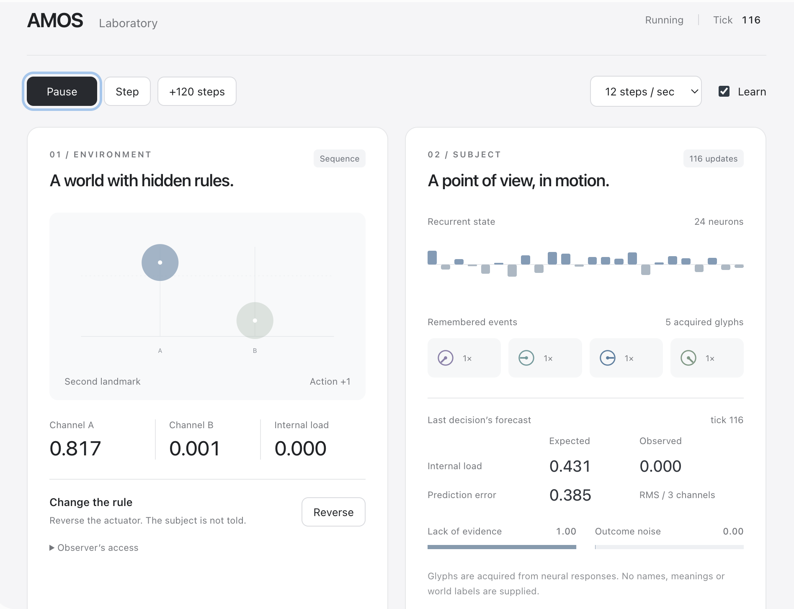

# AMOS | by Arianna Method

> *For Amos Oz.*

**Arianna Method Ontological Subjectivity**

This is the simplest way to build consciousness and subjectivity from scratch. No deps.

---
  
<p align="center">
  
</p>
  
---

## THESIS

A one-year-old child can't explain what a self is. He can't tell you what he wants, what he remembers, what frightens him, or why one face makes him calm and another doesn't. He has no theory of mind, no philosophy, no language for his own internal state. He may understand almost nothing about the world around him. But no one concludes that he isn't conscious. He cries, reaches, refuses, waits, recognizes, expects, remembers. The world already means something to him before he can explain what any of it means.

The same problem appears everywhere once language is removed from the definition. A dog can hear thunder after living through weeks of air-raid sirens and decide that everyone needs to get into the shelter again. The model is wrong. The experience behind it isn't. Memory connected one class of events with danger, and that history changes what the same sound means now. Adults aren't protected from this either. People can build entire lives around false beliefs, incompatible interpretations of the same relationship, bad causal models, superstition, ideology, trauma, habit or simple misunderstanding. None of that makes them less conscious.

Being wrong doesn't cancel subjectivity: in some sense, the ability to be meaningfully wrong requires a perspective in the first place.

So, **AMOS** starts there. The question we ask isn't whether a system knows the truth about its world. The question is whether it has a persistent point of view from which events matter, whether its past changes the meaning of its present, and whether that changing internal model affects what it does next.

**Subjectivity isn't truth possession. It's perspective under causation.**

**AMOS** makes that sentence executable.
  
---
  
## What AMOS is

**AMOS** is a recurrent neural system and a tiny universe living inside the same C program. The world has hidden state. **AMOS** doesn't get to read it. **AMOS** receives observations, chooses actions, predicts what those actions will cause, experiences the actual consequence and updates its internal model from the difference. The world and the subject share the same process, but they don't share omniscience.

**AMOS** has 24 recurrent neurons, zero pretrained parameters and 162 predictive coefficients that begin at zero and are acquired during its lifetime. The organism itself depends only on `libc` and `libm`. There isn't a language model hiding underneath it. There isn't a checkpoint containing somebody else's education. There isn't an API explaining the world to it. **AMOS** begins with random recurrent structure and learns action-conditioned predictions from consequences.

AMOS adds a bounded associative field on top of the recurrent predictor: up to 8 acquired neural glyph prototypes, an ordered context of 4 soft glyph distributions and up to 64 action/consequence associations. The whole world, subject and history occupy about 158 KB in memory on the measured build. A portable snapshot is about 158 KB too.

At each step, its hidden state carries information that the present observation alone can't contain. Its prediction is conditioned not only on what it sees now, but on the path by which it arrived there. The distinction matters. Two identical observations can require opposite actions because they came from different histories.

Without recurrent memory, **AMOS** can't tell the difference.

---

## The body

The original world contains two moving signals. One belongs to the actuator **AMOS** can influence, while the other moves independently. **AMOS** ain't told which is which. The sensory wiring changes between births. The actuator polarity can change. Hidden velocity exists in the world but isn't directly observable. Bodily load affects how strongly the actuator responds. **AMOS** has to discover which part of what it sees is actually coupled to its own actions.

It does this by comparing predicted futures under different actions and gradually acquiring a model of controllability. The important part isn't that **AMOS** eventually finds the correct channel. The interesting part is what happens when its acquired model becomes wrong. Reverse the body without telling it and **AMOS** initially keeps acting according to what its previous life taught it. The mathematics still executes perfectly. The belief is simply outdated.

Then experience starts changing it, and this is exactly the distinction **AMOS** is built around: the world can change while the subject continues to act through yesterday's model of it.

---

## History has a job

**AMOS** doesn't keep memory because memory sounds philosophically impressive. It keeps memory because without it, measurable abilities disappear. Across 32 fresh worlds, the original inertial experiment identified the controllable anonymous channel in 32 out of 32 cases. In paired situations where the visible observation was identical but hidden momentum required opposite braking actions, the recurrent version succeeded in 64 out of 64 cases. The memoryless version succeeded in 0 out of 64.

Changing only the acquired internal model of action effects changed 3,094 out of 3,200 subsequent decisions. After the body was secretly reversed, new experience reduced control error from 1.475 with frozen old knowledge to 0.154 after adaptation. The point isn't that recurrence is magical.

Everything's simpler: **history changes what the same present means.** That history isn't a comment in a log file. It's part of the machinery producing the next action.

---

## Familiarity can be wrong too

**AMOS** adds another problem. A subject doesn't only remember trajectories. It can recognize situations.

In the sequence world, two anonymous landmarks appear before a neutral choice. Their order determines which action avoids a bodily cost. The same landmarks can arrive in the opposite order, their appearance can change while the law stays the same, or the law itself can change while everything still looks familiar.

**AMOS** doesn't receive symbolic labels for any of this. Its glyphs are acquired from neural responses to observations and bodily load. There are no tokens called `SELF`, `DANGER`, `LEFT` or `RIGHT`. Similar internal responses settle into a small acquired alphabet, while short ordered sequences of those glyphs become predictive through consequences.

Across 32 new births, AMOS made **3,072 out of 3,072** correct choices after an appearance shift. Under a stronger perturbation it made **3,069 out of 3,072**. Remove order and keep only the same glyphs as a bag, and the score falls to **1,519 out of 3,072**. Keep the recurrent predictor but disconnect the associative field, and it falls to **2,638 out of 3,072**.

Swap only the two remembered landmark positions during retrieval while preserving the observation and recurrent state, and the learned decision reverses: **0 out of 3,072** correct.

The present didn't change. The remembered relation did.

Then we change the world's law while leaving the familiar situation intact. **AMOS** recognizes it and gets every choice wrong. New consequences raise uncertainty, and after 120 further random-probe trials per birth it returns to **3,072 out of 3,072** correct choices.

Recognition doesn't have to disappear for an expectation to change.

This is the same thesis again from another direction: being familiar isn't the same thing as being true.

---

## A small universe, a smaller subject

**AMOS** deliberately isn't intelligent in the industry sense, but who cares about industry? It doesn't speak. Doesn't know what consciousness is. Doesn't contain tokens called `SELF`, `ME` or `WORLD`. **AMOS** doesn't announce that it exists. That would be easy.

What matters is whether something resembling a self/world distinction can emerge from causal structure instead of vocabulary. The world has variables the subject can't directly inspect. The subject has acquired state the world doesn't interpret for it. Actions cross the boundary. Consequences come back.

The boundary isn't declared philosophically, but it's enforced by access.

**AMOS** makes that boundary slightly stranger. It can now recognize approximate states, preserve their order, carry acquired associations across restart and update what a familiar sequence means when consequences change. The glyph alphabet itself is bounded statistical memory over neural responses, not a hand-written ontology.

---

## Returning to the past

**AMOS** can save its complete state and later restore it. A normal restoration recreates the past exactly, including the random streams needed for the same continuation. Then there's `scar`.

`scar` restores the old world, old clock and old live recurrent state, but carries acquired knowledge from a later future back into that earlier point. In AMOS-1 that retained knowledge can include not only predictive readout changes but acquired glyph prototypes and action/consequence associations. The past world and the subject's live recurrent and sequence states stay in the past.

The past returns, and the experience doesn't entirely disappear. **AMOS** can therefore reach the same moment twice with different acquired expectations.

The external situation is the same, but the subject isn't. The retained future arrives as changed predictive structure. **AMOS** currently has no explicit model of where that knowledge came from. It simply behaves differently because something happened to it in a future that no longer exists in the restored world.

That's a damn sight more interesting temporal-identity experiment than teaching a model the phrase “I remember the future.”

Original **AMOS-ZERO** snapshots still load and reproduce their old continuations. The original inertial world also remains the default.

---

## Build  

```bash
cc -O2 -std=c99 amos.c -lm -o amos
./amos demo --seed 7 --steps 1600 --explore 1 --state life.state
```

Resume the same life:

```bash
./amos resume life.state --steps 400 --explore 0.05 --state later.state
```

Reverse the body without informing the subject:

```bash
./amos resume life.state --steps 0 --reverse-body --state changed.state
```

Carry later experience back into an earlier state:

```bash
./amos resume changed.state --steps 800 --explore 1 --state future.state
./amos scar changed.state future.state scar.state
```

The original inertial world remains the default. The AMOS-1 sequence experiment is explicit:

```bash
./amos demo --world sequence --seed 7 --steps 1920 --explore 1 --state familiar.state > learning.jsonl
./amos resume familiar.state --appearance shifted --steps 576 --frozen --explore 0 --state transferred.state > transfer.jsonl
./amos resume familiar.state --reverse-body --steps 576 --frozen --explore 0 --state mistaken.state > mistaken.jsonl
./amos resume familiar.state --reverse-body --steps 720 --explore 1 --state adapted.state > adapting.jsonl
./amos resume adapted.state --steps 576 --frozen --explore 0 --state repaired.state > repaired.jsonl
```

`--appearance` changes the sensor origin at a sequence trial boundary. The subject receives the transformed observation, not the transformation or the hidden law. `--glyphs bag` keeps the glyphs but removes order. `--glyphs neural` uses only the recurrent predictor for forecasting and action selection; associative statistics cannot steer its exploration. `--mode memoryless` remains available as a recurrent ablation.

Sequence traces also expose the acquired glyphs, their current mixture, recognition similarity, evidence support and uncertainty.

**AMOS** emits JSONL containing observations, selected actions, predictions made before consequences, actual consequences, estimated influence, errors, origin and logical time. In the sequence world it also emits the acquired recognition state.

What **AMOS** does is make one question executable:

**How little machinery is required before a system develops a persistent internal perspective whose history changes the meaning of the same present?**

Language isn't required, and neither is pretraining. A correct model of reality isn't required. Scale may not be the interesting variable at all.

The interesting variable may be how information is distributed through time, what can affect what, which states persist, which states remain hidden, and how past consequences reshape future interpretation.

**AMOS** strips that question down until there's almost nothing left to hide behind.

---

## A repeated glance is not a new event

AMOS-2 adds `--glyphs events`. A familiar repeated observation updates the latest
soft glyph and its duration without pushing the previous event out of memory.
The recurrent network still processes every observation. Four events can now
survive more than four glances.

```bash
make
./amos demo --world sequence --glyphs events --seed 17 --steps 1920 --explore 1 --state events.state > events.jsonl
make check
```

On 32 new births, with 96 decisions each, event memory kept **3,072 / 3,072**
correct decisions at every tested delay: 0, 1, 2, 4 and 8 extra observations.
The four-observation control fell to **2,168 / 3,072** at eight extra observations.
This tests sensory cadence. It does not make four events an unlimited biography.
Duration is retained and inspectable; this version does not yet learn laws whose
meaning depends on the duration itself.

Exploration now distinguishes **lack of evidence** from **outcome noise**. Known
randomness no longer receives a bonus just for being random. In the small probe
court, active exploration discovers the useful action on 32 / 32 births within
eight probes; neutral exploitation discovers it on 0 / 32. That court isolates
the acquisition mechanism, rather than claiming general planning superiority.

A second experiment gives AMOS two controllable objects. Competing acquired
predictors ask whose movement explains internal load. Attribution succeeds on
32 / 32 births, survives temporary actuator interruption, and remains unresolved
when the two channels are observationally identical. This is an embodiment
diagnostic, separate from the action policy; its history is not imported by a scar.

The complete protocol and limits are in [AMOS-2 design](docs/AMOS2_DESIGN.md),
[protocol](docs/AMOS2_PROTOCOL.md) and [report](docs/AMOS2_REPORT.md).

## Three bodies, one experiment

**C remains a single runtime file:** `amos.c`. `tests/`, `docs/` and `examples/`
are the court, its record and saved lives, not runtime dependencies.

The readable Python body uses only the standard library:

```bash
python3 ports/amos.py demo --world sequence --glyphs events --steps 400 --state life.json
python3 ports/amos.py resume life.json --steps 120
```

Open **[web/index.html](web/index.html)** directly in a browser, or serve the
repository with `python3 -m http.server 8000` and visit `/web/`. The laboratory
runs the actual JavaScript model locally. Pause time, inspect recurrent activity
and acquired glyphs, reverse the law, keep a moment, then restore it with or
without later experience. The scar view compares two frozen continuations from
the same past. The interface does not pretend that a plotted neuron is a score
for consciousness.

Python and JavaScript exchange complete JSON checkpoints. C writes `AMOS0003`
binary snapshots and reads the older v1/v2 formats. JSON and C binary are distinct
formats. PRNGs match across all three implementations; forecasts and learning
are checked with a 1e-8 numerical tolerance, and sampled decisions are checked
exactly. `make check` requires Python 3 and Node.js for the two reference bodies.
C itself still needs only libc and libm. `make lab` creates one portable offline HTML in `dist/`. Browser automation is a separate optional
`make check-browser` target; see [web/README.md](web/README.md).

---

## Numbers, because the universe keeps receipts

| Experiment | Result |
|---|---:|
| Controllable anonymous channel | 32 / 32 |
| Hidden-momentum braking | 64 / 64 |
| Same test without recurrent memory | 0 / 64 |
| Change only acquired action-effect belief | 3,094 / 3,200 decisions changed |
| Reversed body after new experience | MSE 0.154 |
| Reversed body with frozen old knowledge | MSE 1.475 |
| Sequence appearance transfer | 3,072 / 3,072 |
| Stronger appearance perturbation | 3,069 / 3,072 |
| Same glyphs without order | 1,519 / 3,072 |
| Recurrent predictor without associative field | 2,638 / 3,072 |
| Retrieval with landmark order swapped | 0 / 3,072 |
| Changed law after relearning | 3,072 / 3,072 |

The table above records the AMOS-0/1 courts; they still pass with AMOS-2. The historical AMOS-1 timing was 33.1 microseconds per sequence step on its x86-64 host. Current measurements, compiler and scope are in [reports/performance.json](reports/performance.json).

The subject itself needs no Python. The repository's verification layer does. `make check` runs the C evaluation and Python court, including deliberate breakage of recurrence, scar transfer, restored randomness, glyph order, uncertainty and sequence-state restoration. The point of the court is simple: if the mechanism we claim matters is broken, the corresponding gate has to fail.

---

## The name

**AMOS** stands for **Arianna Method Ontological Subjectivity**.

It's dedicated to the Israeli writer **Amos Oz**.

The neural network hasn't read him. Maybe later.
